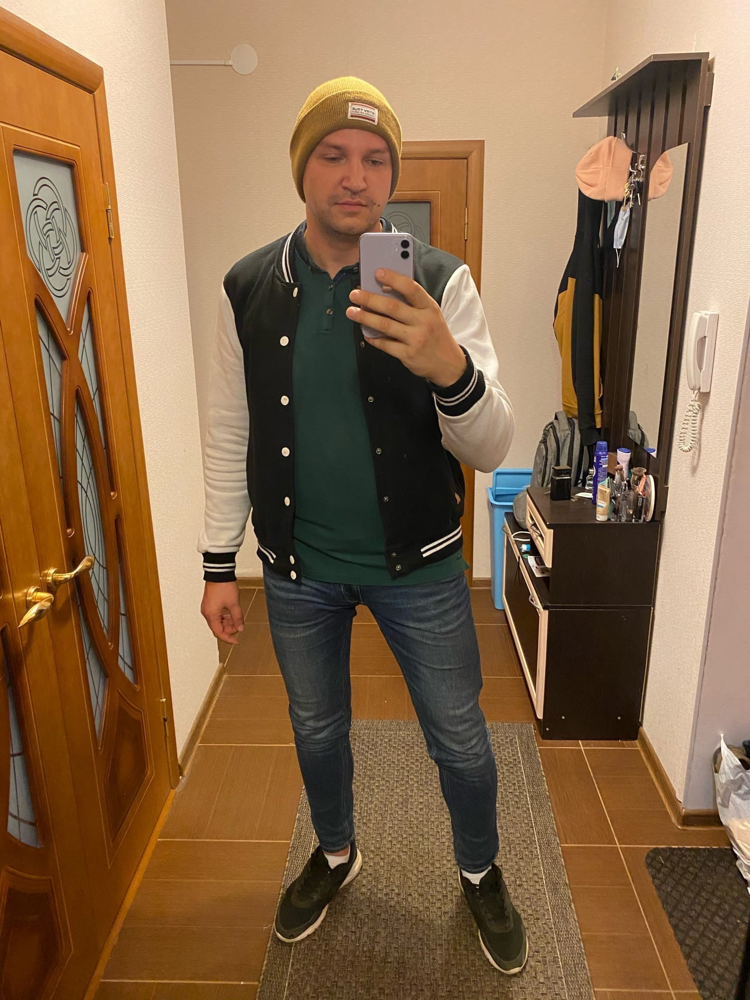

# В ДВУХ СЛОВАХ О СЕБЕ
## Лонской Артем Евгеневич  36 лет

**Основные навыки:**
1. Управление торговыми объектами формата гиппермаркет
2. Организация бизнес-процессов
3. Производство корпусной мебели
4. Организация работы общепита

**Направления деятельности на данный момент**
- Владелец сети кофеен
- Изучение процессов стройки малоэтажных зданий
- Стройка собственного дома
- Изучение Java Script в Нетологии

[Больше информации на моей VK-странице](https://vk.com/coffeeman40) 
